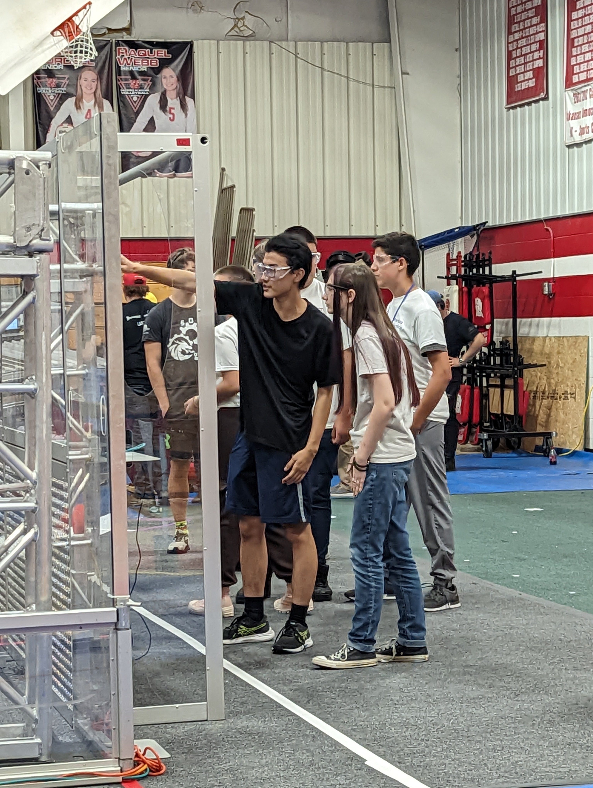

# White Station High School Robotics

We Build Robots-

White Station High School Robotics, founded in 2010 in Memphis, Tennessee, joined [FIRST](https://www.firstinspires.org/) in 2013. FIRST is an international organization that uses competitive robotics as a vehicle for promoting science & technology, allowing high school students to work side by side with professional mentors to learn skills ranging from engineering to marketing, animation and business. As a part of FIRST, we compete in the FRC league, which is the highest level of competition for high school students.

The White Station Robotics Team inspires and encourages our students to do great things. Whether they're in marketing, programming, design, or the build team every student has a part to play in the success of the team.

